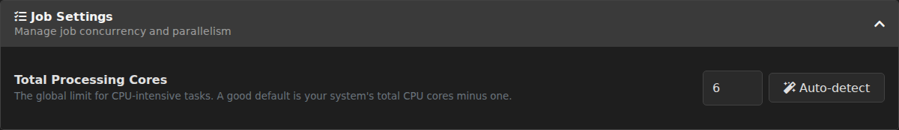
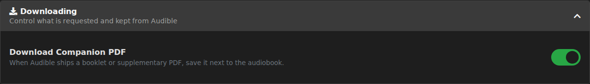
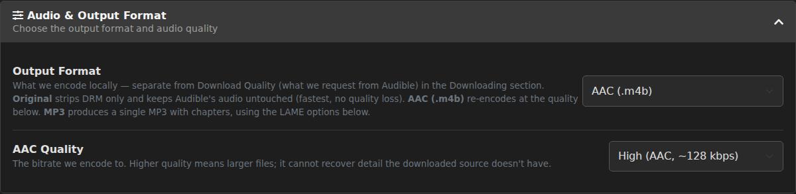
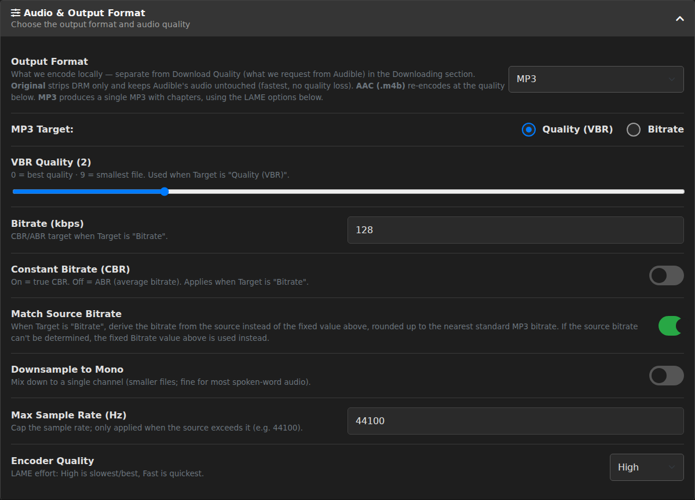
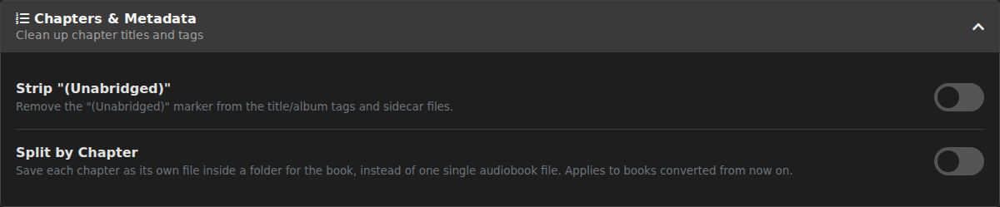
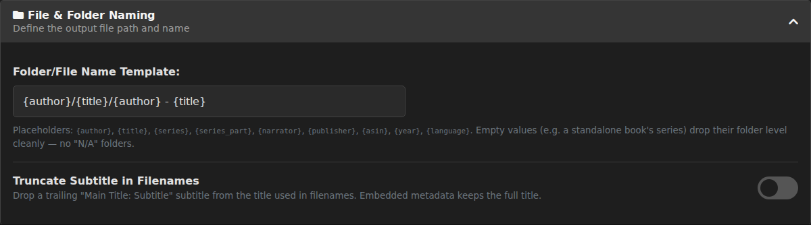
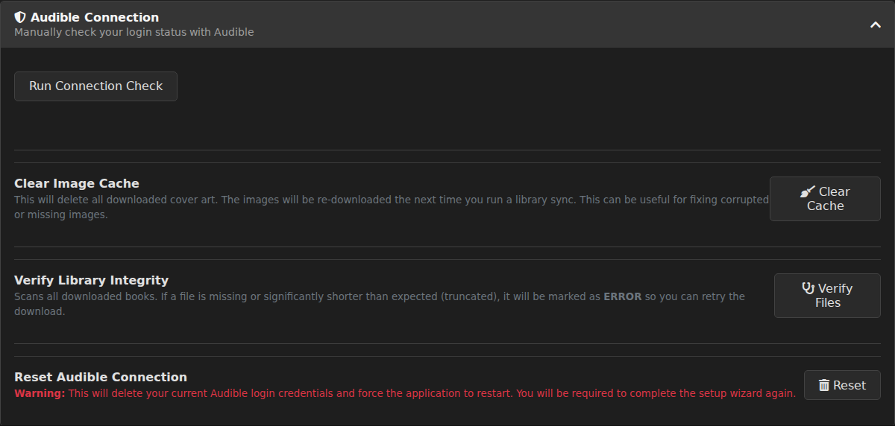
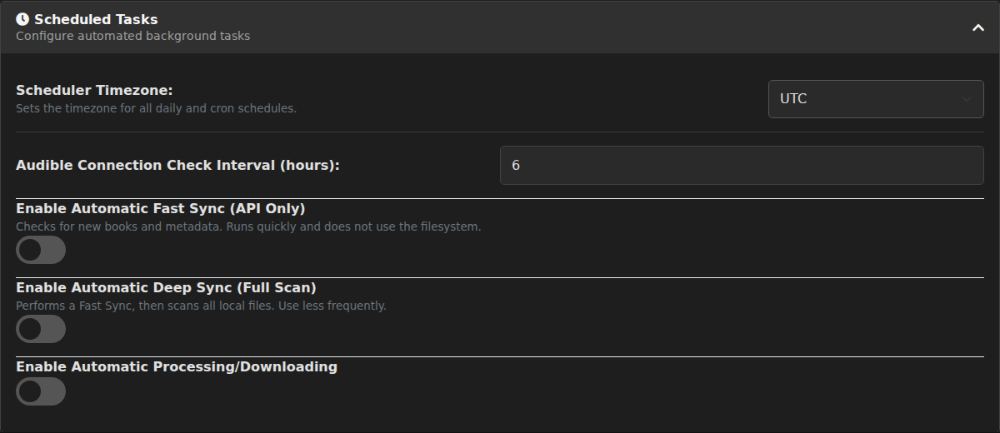
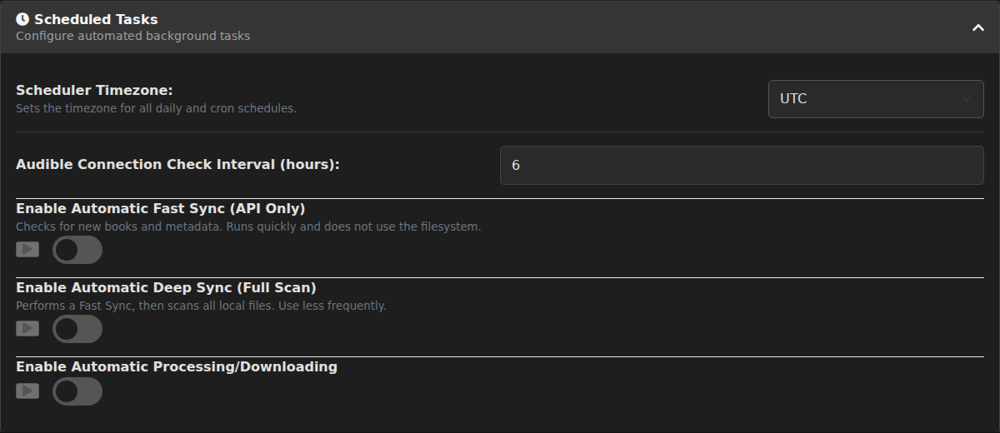
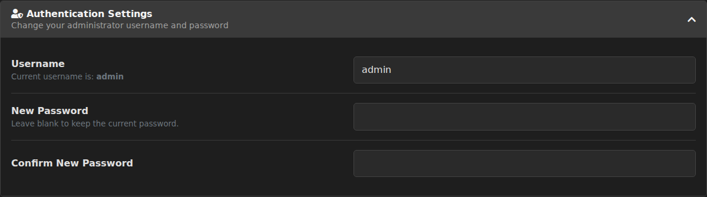

[← Docs index](README.md)

# Settings & Configuration

This page documents every setting on the **Settings** page (the gear icon on the dashboard, or `/settings` directly), section by section. Within each section the standard options come first and the advanced ones after — which is close to, but not always exactly, the on-screen order, since a couple of sections put an advanced control at the top.

## Before you start

**Advanced Mode.** A single toggle in the page header, next to the theme switcher, reveals a larger set of expert options throughout the page — things like MP3 encoder tuning, chapter cleanups, and cron scheduling. It's off by default so first-time users see a short, approachable list; flip it on whenever you want the full set. Every option documented below as "advanced" is hidden until you turn this on. The toggle is itself a saved setting, so it sticks across page reloads — but only once you've clicked **Save Changes**; flipping it and leaving the page without saving won't persist.
Default: `Off`.
`settings.json: advanced_mode_enabled — default false`

**Export as JSON / Import from JSON.** At the bottom of the page, these two buttons let you download your entire configuration as a `.json` file, or load one back in. Useful for backing up your setup before experimenting, or copying your configuration to a fresh install. Importing merges the file over your current settings — every key the file contains replaces your current value, and anything it doesn't mention is left alone — then reloads the page. One caution on the export: the file includes your (hashed) web-UI login credential, so keep it private and don't post it anywhere public.

**Save Changes.** Nothing you change on this page takes effect until you click **Save Changes** at the bottom. Most changes apply immediately after saving; changing your username or password is the one exception — see [Authentication Settings](#authentication-settings) below.

**Where this all lives.** Every setting on this page is a value inside a single file, `settings.json`, stored in the `/config` volume on your host (by default `./appdata/config/settings.json`). The Settings page is really just a friendly editor for that file — you *can* hand-edit it directly (each option below lists its exact key), but the UI is safer: it always writes a well-formed file with the keys in the shape the app expects. What it doesn't do is vet the values themselves — the ranges listed below are guidance the input fields offer, not limits enforced when you save.

Screenshots for each section below are placeholders for now and will be filled in over time.

## Job Settings

**Total Processing Cores**
Sets the global ceiling on how many CPU-intensive tasks (audio encoding, decryption) can run at once across the whole app. A good starting point is your system's total CPU core count minus one, leaving a core free for the OS and the web UI. Click **Auto-detect** to have the app measure your system's hardware and fill in a suggested value for you.
Range: 1–16 in the UI (Auto-detect may suggest a higher value on machines with many cores). Default: `2`.
`settings.json: job.download.total_processing_cores — default 2`

<b>Advanced options — Job Settings</b> (visible when Advanced Mode is on)

**Max Parallel Downloads**
Limits how many books can be downloaded from Audible's servers at the same time. This is separate from Total Processing Cores above — that setting governs local CPU work (encoding), while this one governs concurrent network requests to Audible.
Range: 1–5. Default: `2`.
`settings.json: job.download.max_parallel_downloads — default 2`

## Downloading

**Download Companion PDF**
When Audible ships a booklet or other supplementary PDF alongside a title, save it next to the finished audiobook. On by default — not every book has one, so most of the time it changes nothing; turn it off if you'd rather never have the extra file.
Default: `On`.
`settings.json: conversion.download_supplementary_pdf — default true`

<b>Advanced options — Downloading</b> (visible when Advanced Mode is on)

**Download Quality**
Controls what AudioBookup *requests* from Audible when fetching the source file — a distinct axis from the output quality below, which controls what AudioBookup *produces* locally after downloading. "Best" asks for the highest-quality tier Audible offers for that title; "High" and "Normal" request smaller source files, which download faster and use less bandwidth but start from a lower-quality source. This setting has no effect on the AAC/MP3 encode settings elsewhere on this page — those act on whatever source file this setting fetched.
Choices: Best (highest available) / High / Normal (smallest). Default: `best`.
`settings.json: conversion.download_quality — default "best"`

**Keep Raw Download (AAX/AAXC)**
Normally, the encrypted source file Audible sends (an `.aax` or `.aaxc`) is deleted once conversion finishes successfully. Turn this on to keep it next to the finished audiobook instead — for `.aaxc` downloads this also keeps the accompanying `.voucher` file, which is required to decrypt it again later. Useful if you want a permanent backup of the original Audible-format file, but it roughly doubles the disk space used per book, since you're keeping both the source and the converted output.
Default: `Off`.
`settings.json: conversion.retain_aax — default false`

## Audio & Output Format

**Output Format**
The single most consequential setting on this page — it decides what kind of file AudioBookup produces locally, separate from Download Quality above (which only affects what's requested from Audible).

- **Original (remux, no re-encode):** Strips Audible's DRM and re-packages the decrypted audio untouched — chapters, metadata, and cover art get muxed in, but the audio itself is never re-encoded. This is the fastest option and involves zero quality loss, since nothing is recompressed. Trade-off: file sizes match whatever Audible originally shipped, and the "Strip Audible Branding" and MP3-only options below don't apply to it.
- **AAC (.m4b):** Re-encodes the audio to AAC at the quality level chosen just below, producing a standard `.m4b` audiobook file — the most broadly compatible option across audiobook and podcast apps.
- **MP3:** Encodes a single MP3 file (with embedded chapters) using the LAME encoder options in the advanced block below. The most universally playable format, at the cost of losing some of the chapter/format niceties dedicated audiobook players offer for `.m4b`.

Choices: Original / AAC (.m4b) / MP3. Default: `m4b` (AAC).
`settings.json: conversion.output_format — default "m4b"`

**AAC Quality** *(shown only when Output Format is AAC (.m4b))*
The bitrate AudioBookup encodes to when producing an AAC `.m4b`. Higher settings produce larger files with more headroom for the source material's detail — but re-encoding can never recover detail the downloaded source doesn't already have, so there's no benefit to picking a quality higher than what Download Quality actually fetched.
Choices: High (~128 kbps) / Standard (~96 kbps) / Low (~64 kbps). Default: `High`.
`settings.json: conversion.quality — default "High"`

<b>Advanced options — Audio & Output Format</b> (visible when Advanced Mode is on)

The following options only appear, and only apply, when **Output Format** is set to **MP3**. They configure the LAME MP3 encoder.

**MP3 Target**
Chooses which of the two options below actually controls the encode: **Quality (VBR)** uses the VBR Quality slider; **Bitrate** uses the Bitrate field (and the CBR/Match Source options that go with it).
Choices: Quality (VBR) / Bitrate. Default: `quality`.
`settings.json: conversion.mp3.target — default "quality"`

**VBR Quality**
A 0–9 slider used when MP3 Target is "Quality (VBR)". `0` targets the best quality (largest files); `9` targets the smallest files (lowest quality). The live number next to the slider updates as you drag it.
Range: 0–9. Default: `2`.
`settings.json: conversion.mp3.vbr_quality — default 2`

**Bitrate (kbps)**
The constant/average bitrate target used when MP3 Target is "Bitrate".
Range: 32–320. Default: `128`.
`settings.json: conversion.mp3.bitrate_kbps — default 128`

**Constant Bitrate (CBR)**
When Target is "Bitrate", this decides whether the encode is true CBR (fixed bitrate throughout, this toggle on) or ABR — average bitrate, which lets simpler passages use fewer bits (this toggle off).
Default: `Off` (ABR).
`settings.json: conversion.mp3.constant_bitrate — default false`

**Match Source Bitrate**
Also only relevant when Target is "Bitrate". When on, the encoder derives its bitrate from the source file's own bitrate instead of the fixed Bitrate value above, rounding up to the nearest standard MP3 bitrate — so a high-quality source doesn't get needlessly downgraded to a generic default. If the source's bitrate can't be determined, the fixed Bitrate field above is used as a fallback.
Default: `On`.
`settings.json: conversion.mp3.match_source_bitrate — default true`

**Downsample to Mono**
Mixes the audio down to a single channel before encoding. Spoken-word audiobooks rarely benefit from stereo, so this is a straightforward way to shrink file size with no perceptible quality loss for most listeners.
Default: `Off`.
`settings.json: conversion.mp3.downsample_mono — default false`

**Max Sample Rate (Hz)**
Caps the output sample rate. Only takes effect when the source file's sample rate is actually higher than this value — a source that's already at or below the cap passes through unchanged.
Range: 8000–48000 (step 50). Default: `44100`.
`settings.json: conversion.mp3.max_sample_rate — default 44100`

**Encoder Quality**
The LAME encoder's internal effort level — a speed/quality trade-off for the encoding algorithm itself, distinct from VBR Quality or Bitrate above. "High" is the slowest and most thorough; "Fast" trades some encoding precision for speed.
Choices: High / Standard / Fast. Default: `High`.
`settings.json: conversion.mp3.encoder_quality — default "High"`

## Chapters & Metadata

**Strip "(Unabridged)"**
Removes the "(Unabridged)" marker that Audible appends to many titles, from both the title and album tags. Purely cosmetic — has no effect on the audio itself.
Default: `Off`.
`settings.json: conversion.chapters.strip_unabridged — default false`

<b>Advanced options — Chapters & Metadata</b> (visible when Advanced Mode is on)

**Combine Nested Chapter Titles**
Some audiobooks ship a nested chapter tree (for example, a "Part" chapter containing several "Chapter" children). This flattens that tree into one single-level list of chapters, and joins each child's title to its parent's with `": "` — so "Part One" containing "Chapter 1" becomes a single chapter titled "Part One: Chapter 1". Leaving this off keeps today's behavior: only the top-level chapters are used, and any nested children are ignored.
Default: `Off`.
`settings.json: conversion.chapters.combine_nested_titles — default false`

**Merge Credit Chapters**
Folds "Opening Credits" and "End Credits" chapters into their neighbors instead of leaving them as separate, often very short, chapter entries — Opening Credits gets absorbed into the chapter that follows it, End Credits into the one before it.
Default: `Off`.
`settings.json: conversion.chapters.merge_credit_chapters — default false`

> **Interaction with Combine Nested Chapter Titles:** when both are enabled, Combine Nested Chapter Titles runs first and Merge Credit Chapters runs second, on the now-flattened list. Merge Credit Chapters only recognizes a chapter whose title is "Opening Credits" or "End Credits" and nothing else — capitalization and surrounding whitespace don't matter, but any extra words mean no match. It checks every chapter in the book, not just the first and last. For the common case — credits chapters sitting at the top level of the chapter tree — flattening doesn't change their titles, so the merge still finds and folds them normally. But if a book nests its credits chapters *underneath* a parent chapter, flattening prefixes their titles with the parent's name (e.g. "Part One: Opening Credits"), and the merge step no longer matches that exact string — so that credits chapter is left in place rather than merged. This is a corner case rather than the norm, since credits chapters are almost always top-level.

**Strip Audible Branding**
Trims Audible's "This is Audible" spoken intro and matching outro from the finished file. This only applies when re-encoding — **AAC** and **MP3** output — because trimming requires an encode pass to cut into; the **Original** remux format is never trimmed, regardless of this setting.
Default: `Off`.
`settings.json: conversion.chapters.strip_audible_branding — default false`

**Chapter Title Template**
A template string used to render every chapter's title, with these placeholders:

| Placeholder | Meaning |
| --- | --- |
| `{ch}` | The chapter's number (1-based) |
| `{ch_total}` | The total number of chapters in the book |
| `{ch_title}` | The chapter's own original title |
| `{title}` | The book's title |

The default, `{ch_title}`, reproduces each chapter's original title exactly, unchanged.
`settings.json: conversion.chapters.chapter_title_template — default "{ch_title}"`

## Sidecar Files

This section covers three of the extra files that can land next to a finished audiobook: the cover image, a `metadata.json`, and a `.cue` sheet. Two others live elsewhere — the companion PDF and the raw AAX/AAXC download are both controlled from the **Downloading** section above.

**Save Cover Alongside**
Saves the book's cover image as its own file next to the finished audiobook, in addition to the copy already embedded inside the audio file itself.
Default: `Off`.
`settings.json: conversion.save_cover_alongside — default false`

<b>Advanced options — Sidecar Files</b> (visible when Advanced Mode is on)

**Save metadata.json**
Writes a curated `.metadata.json` file next to the audiobook, containing the book's details (title, author, narrator, series, and so on) in a plain, machine-readable format — handy for scripting or feeding other tools.
Default: `Off`.
`settings.json: conversion.save_metadata_json — default false`

**Create .cue Sheet**
Writes a `.cue` chapter sheet next to the audiobook, listing each chapter's start time — a format some media players and burning tools can read directly.
Default: `Off`.
`settings.json: conversion.create_cue_sheet — default false`

## File & Folder Naming

**Folder/File Name Template**
The template that builds the output path for every book, combining folder levels and the final filename in one string. Available placeholders:

| Placeholder | Meaning |
| --- | --- |
| `{author}` | The book's author |
| `{title}` | The book's title |
| `{series}` | The series name (blank for standalone books) |
| `{series_part}` | The book's position in its series |
| `{narrator}` | The narrator's name |
| `{publisher}` | The publisher |
| `{asin}` | Audible's unique ID for the title |
| `{year}` | The release year |
| `{language}` | The book's language |

If a placeholder resolves to nothing — most commonly `{series}`/`{series_part}` for a standalone book — that entire folder level is dropped cleanly rather than leaving behind an empty or "N/A" folder.

Default: `{author}/{title}/{author} - {title}` — which produces, for example, `Brandon Sanderson/Mistborn/Brandon Sanderson - Mistborn.m4b`.
`settings.json: naming.template — default "{author}/{title}/{author} - {title}"`

**Truncate Subtitle in Filenames**
Some Audible titles carry a long subtitle after a colon (e.g. "Project Hail Mary: A Novel"). When on, only the part before the first `": "` is used when building the filename — so the example above becomes just "Project Hail Mary" on disk. This only affects the on-disk filename; the full, untruncated title is still written into the file's embedded metadata.
Default: `Off`.
`settings.json: naming.truncate_subtitle — default false`

<b>Advanced options — File & Folder Naming</b> (visible when Advanced Mode is on)

**Apply Custom Metadata to Filenames**
When you manually override a book's title or author (from its detail view), this decides whether that override also renames the file/folder on disk to match. Off (the default) means an override only changes what's displayed in the UI and what's embedded in the file's tags — the on-disk name stays as it was. On means new downloads are named from your override, and editing an existing book's metadata renames its file to match.
Default: `Off`.
`settings.json: naming.apply_custom_to_filenames — default false`

**Folder Template (optional)** and **File Template (optional)**
An alternative to the single Folder/File Name Template above, for when you want the folder structure and the filename to follow genuinely different rules. When *both* fields are non-empty, they compose as `<folder_template>/<file_template>` and override the single template above entirely; leaving either one blank falls back to using the single template. Both use the same placeholders listed above.
Default: both empty (the single template above is authoritative).
`settings.json: naming.folder_template — default ""` / `naming.file_template — default ""`

**File Timestamp Source**
Sets the finished audiobook's file "modified" date (and that of any sidecar files saved alongside it) to a meaningful date instead of the moment it happened to be downloaded — useful for sorting a library by release date or by when you bought it, in a file browser or media server that sorts by modified time.
Choices: Don't change (default) / Book release date / Purchase date. Only applies to books downloaded from the point you enable it forward — it does not retroactively re-stamp files you already have.
Default: `none`.
`settings.json: conversion.file_timestamp_source — default "none"`

## Audible Connection

This section holds no saved settings of its own — it's four on-demand actions for managing your link to Audible and your local library data. Full step-by-step procedures for each are in [troubleshooting.md](troubleshooting.md).

**Run Connection Check** — Immediately tests whether AudioBookup's stored Audible login is still valid, without waiting for the next scheduled check. Useful right after changing your Audible password, to confirm whether you need to reconnect.

**Clear Image Cache** (button labeled **Clear Cache**) — Deletes every cached cover image. They're re-downloaded automatically the next time a sync runs. Handy for fixing corrupted or stuck cover art.

**Verify Library Integrity** (button labeled **Verify Files**) — Scans every downloaded book on disk and flags any that are missing or noticeably shorter than expected (a sign of a truncated download) by marking them **ERROR**, so they show up for an easy retry from the dashboard.

**Reset Audible Connection** — Deletes your stored Audible login credentials entirely and restarts the app, dropping you back into the setup wizard to reconnect. This is a destructive action with its own confirmation prompt; it does not touch your web-UI username or password.

## Scheduled Tasks

> This is also where the dashboard's automation banner sends you — following that banner's link lands you directly on this section via `/settings#tasks`.

**Scheduler Timezone**
The timezone used to interpret every daily and cron schedule configured below (e.g. "run at 03:00" means 03:00 in *this* timezone). This is deliberately separate from the container's own `TZ` environment variable, which sets the container's system clock — see [installation.md](installation.md) for that setting.
Choices: a fixed dropdown list of common IANA zones (UTC, Europe/London, Europe/Berlin, America/New_York, America/Chicago, America/Denver, America/Los_Angeles, Australia/Sydney, Asia/Tokyo). Default: `UTC`.
`settings.json: tasks.timezone — default "UTC"`

**Audible Connection Check Interval (hours)**
How often AudioBookup automatically checks that its stored Audible login is still valid, in the background.
Range: 1–24. Default: `6`.
`settings.json: tasks.audible_auth_check_interval_hours — default 6`

> **Each block hides its own settings until it's switched on.** The three automation blocks below (Fast Sync, Deep Sync, Automatic Processing) keep everything except their **Enable** toggle collapsed out of view while that toggle is off — schedule type, times, and in Automatic Processing's case the status checkboxes and the trigger toggle too. If a block looks like it holds nothing but a switch, turn the switch on and its options appear.

### Automatic Fast Sync (API Only)

Checks Audible for new or changed books via the API only — quick, and doesn't touch the filesystem.

- **Enable toggle:** turns the schedule on/off. `settings.json: tasks.is_auto_fast_sync_enabled — default false`
- **Schedule Type:** **Interval** (run every N hours, 1–168) or **Daily** (run at a specific time). Default schedule: every 4 hours; switch to Daily and the time field starts at 02:00.
- Stored as a single cron string: `settings.json: tasks.fast_sync_schedule.cron — default "0 */4 * * *"`

### Automatic Deep Sync (Full Scan)

Runs everything Fast Sync does, then also scans your local files on disk — heavier, so it's meant to run less often.

- **Enable toggle:** `settings.json: tasks.is_auto_deep_sync_enabled — default false`
- **Schedule Type:** Interval (every N hours, 2–168) or Daily. Default schedule: once daily at 03:00; switch to Interval and the field starts at 24 hours.
- `settings.json: tasks.deep_sync_schedule.cron — default "0 3 * * *"`

### Automatic Processing

Automatically downloads and converts books matching the statuses you select below, on its own schedule.

- **Enable toggle:** `settings.json: tasks.is_auto_process_enabled — default false`
- **Schedule Type:** Interval (every N hours, 2–168) or Daily. Default schedule: once daily at 04:00; switch to Interval and the field starts at 24 hours.
- `settings.json: tasks.process_schedule.cron — default "0 4 * * *"`

**Automatically process books with these statuses:** three checkboxes controlling which library statuses automatic processing acts on:

- **NEW** — books not yet downloaded. `settings.json: tasks.auto_process_new — default true`
- **MISSING** — previously-downloaded books whose file can no longer be found. `settings.json: tasks.auto_process_missing — default true`
- **ERROR** — books whose last attempt failed. `settings.json: tasks.auto_process_error — default false`. Checking this box pops up a warning, and it's worth taking seriously: with ERROR ticked, every scheduled automatic-processing run re-attempts the books that failed. That's exactly what you want for a transient failure — a dropped connection, a temporary Audible hiccup — but a book that fails for a permanent reason, such as a title AudioBookup simply can't convert, will keep being picked up and retried run after run. Enable it to clear out transient failures, and turn it back off if a particular book keeps failing.

**Trigger immediate processing when new books are found by a sync**
Lives inside the Automatic Processing block and only works as part of it: **Automatic Processing must be enabled too**, and while it's off this toggle is hidden entirely. With both on, a successful Fast or Deep Sync kicks off a processing run right away instead of waiting for the schedule above to come around — whether or not the sync actually turned up anything new. That run processes everything matching the status checkboxes above, not only newly-discovered books.
Default: `On`.
`settings.json: tasks.process_new_on_sync — default true`

> **A note on very frequent schedules.** Whenever you save, each of the three schedules is checked for running more often than every 5 minutes — only really reachable via the cron option below. If one is, a warning dialog flags it, but the save still goes through: over-frequent schedules aren't blocked, just strongly discouraged, since they can overlap with themselves and hammer Audible's API.

<b>Advanced options — Scheduled Tasks</b> (visible when Advanced Mode is on)

**Run-now buttons (▶)**
Each of the three automation blocks above gets a small play-button next to its enable toggle, letting you fire that job immediately without waiting for its schedule — useful for testing a new schedule or config right after saving. Each button is only enabled while its corresponding schedule is turned on.

**Cron schedule type**
A fourth **Schedule Type** option, alongside Interval and Daily, for expressing a schedule as a standard 5-field cron string: **M**inute, **H**our, **D**ay of **M**onth, **M**on**th**, **D**ay of **W**eek. Paste a full cron string (e.g. `0 */4 * * *`) into the first (Minute) field and all five fields auto-populate from it. See [crontab.guru](https://crontab.guru/) for help constructing cron expressions.

## Authentication Settings

**Username**
Your web-UI login username. The current value is shown just above the field.
Default: `admin`.
`settings.json: username — default "admin"`

**New Password** / **Confirm New Password**
Sets a new web-UI login password. Leave both fields blank to keep your current password unchanged. The **Confirm New Password** field is a convenience check in your browser — it flags a mismatch as you type, but it isn't what decides what gets saved, so double-check that both fields match before you save. If you're ever unsure what actually got stored, the password-reset procedure in [troubleshooting.md](troubleshooting.md#resetting-your-local-web-ui-password) puts you back to a known password.
Minimum length: 8 characters.
`settings.json: password_hash` — your password is only ever stored hashed; the plain text you type into these fields is never written to the file.

> **Saving either of these logs you out immediately.** Changing your username or password takes effect right away. AudioBookup asks you to confirm first — a dialog warning you that you're about to be logged out — then saves, shows a success message, and after about three seconds sends you to the login page to sign back in with the new credentials. Everything else on this page saves without logging you out.

## Hidden and expert settings

Some keys in `settings.json` have no corresponding control anywhere on the Settings page — either because they're too rarely needed to deserve UI real estate, or because they're purely internal bookkeeping. The ones worth knowing about are below. You can still set them by hand-editing `settings.json`, or by including them in a JSON file used with **Import from JSON**.

**`import.max_upload_gb`** — caps the size, in gigabytes, of a single file accepted by the manual-import upload feature. There's no UI control for this; change it only by editing `settings.json` directly or importing a settings file that sets it.
Default: `2`.

**`conversion.no_reencode`** — a legacy flag from before the **Output Format** setting existed. It's kept around purely so that older `settings.json` files (saved before this option existed) keep working — `conversion.output_format` now supersedes it entirely, and the app derives one from the other automatically when it detects an old-style file. You should not need to touch this directly; use **Output Format** instead.

**`initial_setup_complete`** and **`password_hash`** — internal bookkeeping the app manages itself: whether you've been through the first-time setup wizard, and your hashed (never plaintext) login password. Don't hand-edit these except as part of the password-reset procedure described in [troubleshooting.md](troubleshooting.md), which involves deleting the `password_hash` line to fall back to the default password.
