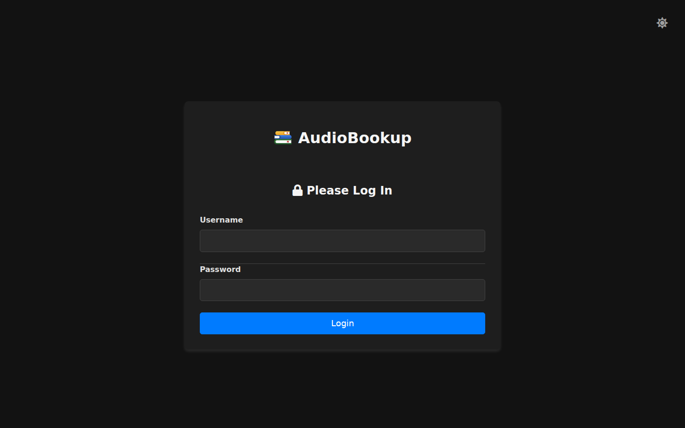
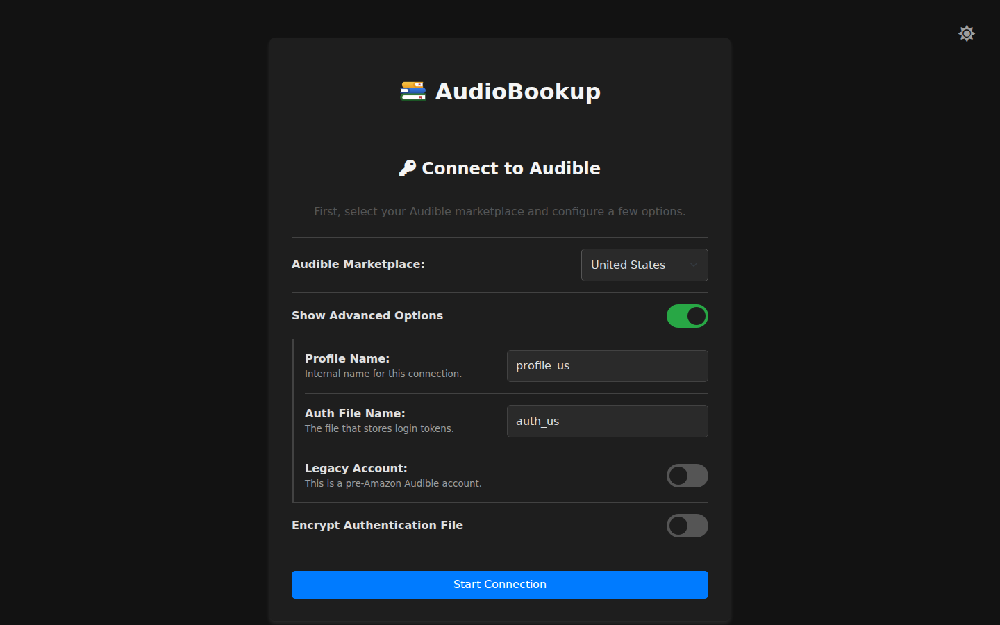
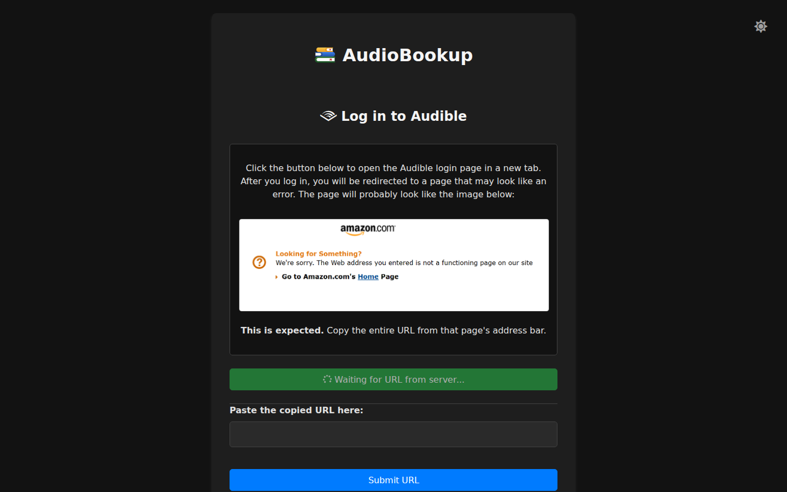
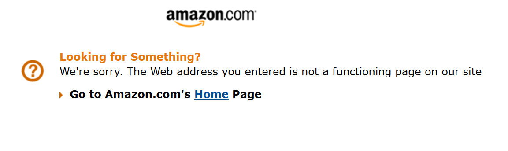
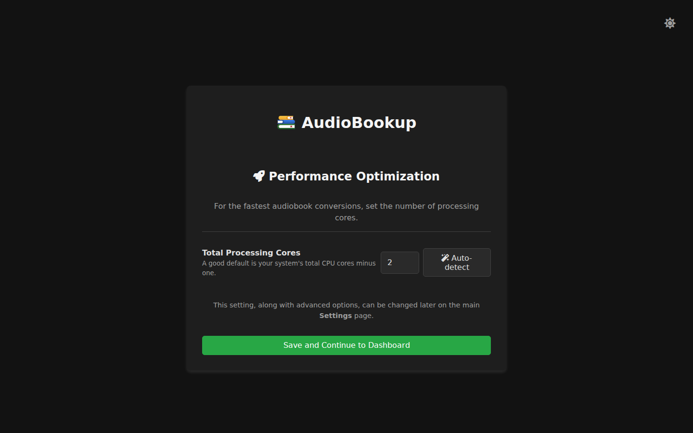

[← Docs index](README.md)

# First-Time Setup

The first time you open AudioBookup, it walks you through a short setup process before handing you the main dashboard: log in with the default password, replace it with one of your own, then connect your Audible account. This guide covers all of it. If you haven't installed the container yet, start with [installation.md](installation.md).

## Step 1: Log in with the default credentials

Open `http://<your-server-ip>:13300` in a browser. On a brand-new install, this takes you to the login page.

Sign in with the built-in default credentials:

- **Username:** `admin`
- **Password:** `changeme`

## Step 2: Set your own password

As soon as you log in, AudioBookup sends you to an **Initial Setup** screen and won't let you go any further until you've replaced that default password.

Choose a password (at least 8 characters) and confirm it, then click **Set Password and Continue**. This is a local account for AudioBookup's own web interface — it has nothing to do with your Audible account password, and it isn't sent anywhere.

You stay logged in, so there's no second login: saving the new password takes you straight on to the Audible connection wizard in the next step.

You can change either the username or password later from the Settings page — see [Authentication settings](configuration.md#authentication-settings).

## Step 3: Connect your Audible account

Next comes a three-screen wizard that links AudioBookup to your Audible account. Nothing is downloaded yet — this just establishes the connection.

### Screen 1: Connect to Audible

Pick your **Audible Marketplace** — the country your Audible account is registered in (US, UK, Canada, Germany, France, Australia, Japan, India, Italy, or Spain).

Most people can leave everything else at its defaults and click **Start Connection**. If you expand **Show Advanced Options**, you'll also see:

- **Profile Name** and **Auth File Name** — internal names for this connection; only worth changing if you plan to connect more than one Audible account.
- **Legacy Account** — turn this on only if your Audible account predates Amazon's acquisition of Audible (pre-2016 accounts that were never merged into an Amazon login).

There's also an **Encrypt Authentication File** toggle, which asks for a password to encrypt the stored login file at rest. It's optional; leave it off unless you have a specific reason to want it.

### Screen 2: Log in to Audible

Click the button to open Audible's own login page in a new browser tab, and log in there with your normal Audible (Amazon) credentials.

After you log in, Audible will redirect you to a page that looks like an error — something like "Looking for something?" or "Page not found." **This is expected and completely normal**, not a sign that anything went wrong. It looks like this:

Copy the entire URL from that page's address bar, paste it into the box back in AudioBookup, and click **Submit URL**. AudioBookup validates it and confirms the connection.

### Screen 3: Performance optimization

Set how many CPU cores AudioBookup can use for converting audiobooks. You can type a number directly, or click **Auto-detect** to let it pick a sensible value based on your system's hardware. Click **Save and Continue to Dashboard** when you're done.

This is just a starting point — you can change it any time from Settings; see [Job settings](configuration.md#job-settings).

## After setup

Saving that last screen takes you straight to the main dashboard — setup is now complete, and you won't see the wizard again. The dashboard starts out empty; run your first library sync (the **Sync Library** button) to pull in your Audible catalog before downloading anything.

Your Audible login is saved in AudioBookup's database volume, so you won't need to repeat this wizard on restarts or updates. If you ever need to reconnect a different account or your connection breaks, see [troubleshooting.md](troubleshooting.md).

---

**Next:** [Using AudioBookup →](usage.md)
