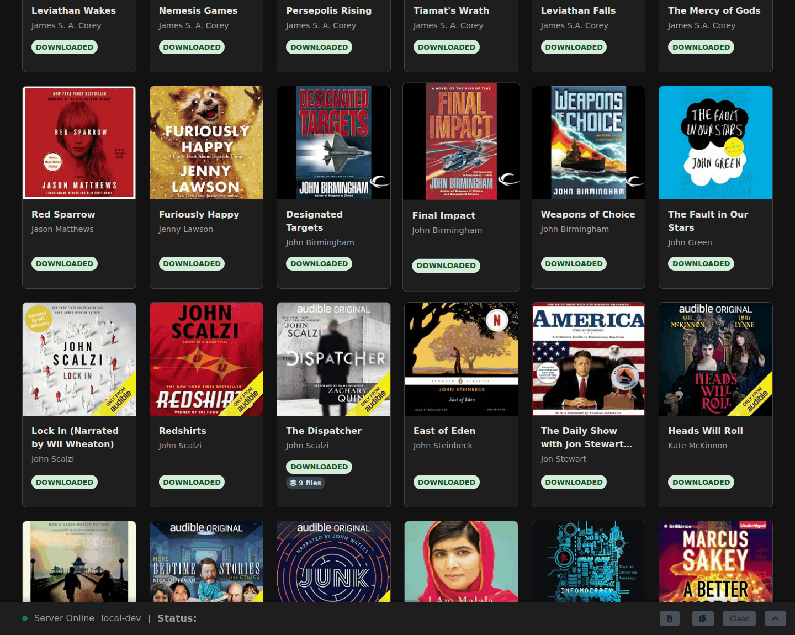
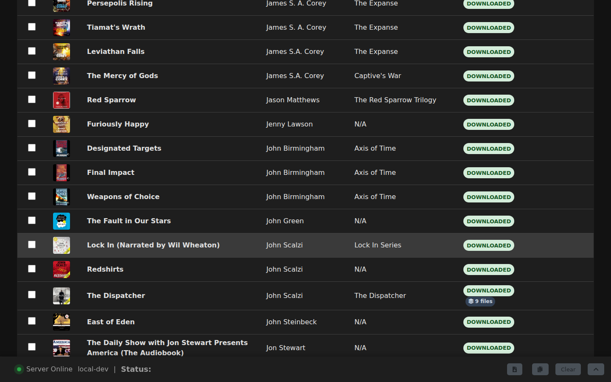
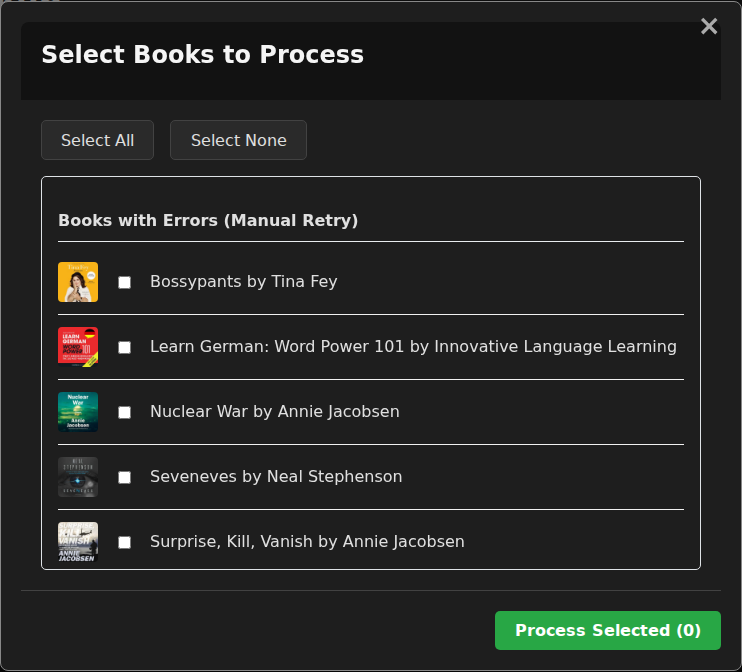
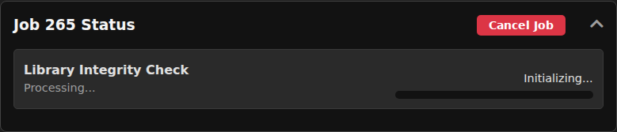
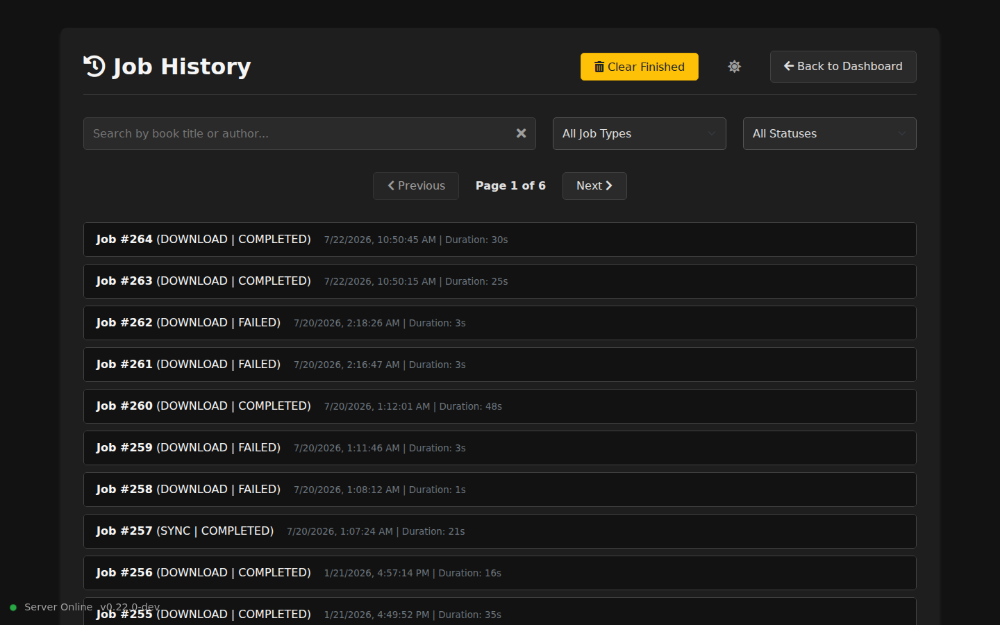

[← Docs index](README.md)

# Using AudioBookup

This is the day-to-day guide to the dashboard: what's on it, what each button does, and how the library, job, and history views behave.

For first-time login and connecting your Audible account, see [setup.md](setup.md). For every setting on the Settings page, see [configuration.md](configuration.md).

## The dashboard

The dashboard is what you land on every time you open AudioBookup.

### Primary actions

- **Sync Library** — runs a Deep Sync (see [overview.md](overview.md#the-core-workflow)): refreshes your database from Audible *and* checks your files on disk, so the app's records match reality before you decide what to download.

- **Process Downloads** — opens a modal for picking which books to download and convert. See [Downloading and converting books](#downloading-and-converting-books) below.

### Automation banner

If part of your automation is switched off entirely, a banner appears just below the action buttons telling you which part. It flags two things:

- **Automatic library sync** — only when *both* sync schedules (Fast Sync and Deep Sync) are disabled. If either one is still running on a schedule, your library is being kept current and the banner stays quiet about sync.
- **Automatic download processing** — when the scheduled processing job is disabled.

Click the banner to jump straight to the scheduling settings: [configuration.md#scheduled-tasks](configuration.md#scheduled-tasks). When neither of those is fully turned off, the banner doesn't show at all.

### The Job Status panel

A collapsible panel shows live progress whenever a Sync, Download, or Verify job is running. A few things worth knowing about it:

- Click the panel's header to expand or collapse it.
- While a job runs, you can safely close the browser tab — reopening the dashboard reconnects to it automatically and picks the progress back up.
- A **Cancel Job** button appears while something is running, and stops it immediately.
- Once a job finishes, a **Clear Finished** button appears to clear the finished entries out of the panel.
- AudioBookup only ever runs **one job at a time**. Starting a second one while another is active is refused with the message "An operation is already in progress."

### Library Status tiles

Four tiles summarize your library at a glance: **Downloaded**, **New**, **Missing**, and **Error**. Click any tile to jump straight down to the library section below, already filtered to that status. See [overview.md#library-statuses](overview.md#library-statuses) for what each one actually means.

## Browsing your library

Below the dashboard sits your full library, with controls for finding and organizing what you're looking at.

### Search, sort, and filter

- **Search** matches title, author, or narrator as you type.
- **Status filter** narrows the list to Downloaded, New, Missing, or Error — or to **Flagged Duplicates**, books whose filename collided with another and were saved with a disambiguating suffix (see [Book details](#book-details) for how to resolve these).
- **Sort** orders the list by author, title, release date, or date added, each ascending or descending.

### Grid, List, and Table views

Three icons next to the controls switch how the library is laid out:

- **Grid** — cover-forward cards, the default browsing view.
- **List** — one row per book, with a bit more metadata visible (narrator, series, release date).
- **Table** — the densest, tabular layout.

Whichever view you pick is remembered the next time you open the dashboard.

A book saved with [Split by Chapter](configuration.md#chapters--metadata) on carries an "N files" badge in every view, so you can tell a multi-file book apart from a normal one at a glance without opening it.

### Bulk selection

List and Table views add a checkbox to each row; Grid view has no checkboxes and stays browse-only. Checking at least one row reveals a **bulk action bar** above the library, showing:

- **N selected** — a running count.
- **Select all shown** — checks every book currently visible under your active search/filter, not your whole library.
- **Clear** — clears the selection.
- **Bulk Rename…** — opens the bulk rename tool (see [Bulk rename](#bulk-rename) below); disabled until something is selected.

Sorting the library or switching between List and Table view leaves your selection intact. Searching or changing the status filter, on the other hand, narrows the selection down to the books still shown — anything the new view hides is quietly dropped from it. That's deliberate: it means a bulk action can never touch a book you can't currently see.

## Book details

Click any book — anywhere but its Download button — to open its detail view.

### What's shown

- Cover art, title, author, narrator, series, publisher, runtime, release date, date added, language, ASIN, and status.
- A summary, truncated by default; click **Get Full Summary** to fetch the complete text if a longer one is available.
- A **File Information** block — path, file type, size, and last modified — once the book is downloaded. For a book saved with [Split by Chapter](configuration.md#chapters--metadata) on, this instead shows the book's folder, "N chapter files," and the total size across all of them, with an expandable list of the individual chapter files. If one or more of those files has gone missing from disk, the count reads "N chapter files (M missing)" and the list opens automatically so you can see which ones — a file that's still there but couldn't be read (for example, a permissions problem) is counted among the M missing too, not just files that are genuinely gone.
- An **Error Information** panel, shown only on books whose most recent download or conversion attempt failed, with the details of what went wrong.

### Actions you can take

- **Change Cover** — upload your own cover image (up to 15 MB) to replace the one pulled from Audible.

- **Download / Force Re-download** — queues the book. A book not yet downloaded gets a plain "Download Now"; an already-downloaded book gets "Force Re-download" behind a confirmation, since it re-converts using your *current* settings and may write a new file rather than overwriting the old one, if your output format or naming template has changed since the original download. That confirmation always asks whether to delete the old file and its companion files once the new one is ready — decline and they're left in place, no matter what — but nothing actually gets deleted unless the new file really did end up somewhere else; if it just overwrites the old one in place, there's nothing to clean up. The [Clean up Replaced Files](configuration.md#downloading) setting skips the question and cleans up automatically instead, including for re-downloads that happen on their own through scheduled processing, where there's no one to ask. If [Split by Chapter](configuration.md#chapters--metadata) is toggled on or off since a book was last downloaded, a Force Re-download switches it between a single file and a folder of chapter files to match — the confirmation copy describes a set of chapter files rather than one file based on how the book is currently stored on disk, not on what the new setting is about to produce, so right at the moment you flip the setting the wording can lag one download behind.

- **Download Annotations** — shown in the File Information block once a book is downloaded. Fetches your clips, notes, and bookmarks for that title from Audible on demand and saves them as an `.annotations.json` file next to the audiobook (inside its folder, for a book saved with [Split by Chapter](configuration.md#chapters--metadata) on) — the same file the [Save Annotations](configuration.md#sidecar-files) setting can produce automatically with every download instead. A book with no clips or bookmarks just reports that none were found; that's the normal case, not an error. If the book's file — or, for a split book, its whole folder — has since been moved or deleted outside the app, this instead fails with an error toast, since there's nowhere left to save the sidecar; a split book whose folder is still there but empty (all chapter files deleted) can also fail, since the app has nothing left to base the sidecar's name on.

- **Edit Metadata** — an inline editor for overriding the title and/or author shown everywhere in the app, with the original Audible value shown as a hint whenever you've overridden it. If your settings also rename files on disk, a warning tells you saving will rename the file — see [configuration.md#file--folder-naming](configuration.md#file--folder-naming). **Reset to Audible** clears your overrides and reverts to the native value.

- **Resolve Duplicate** — shown only on books flagged as duplicates. Choose how to disambiguate the title: append the narrator's name, append the release year, or keep the current ASIN-suffixed name as-is. A live preview shows the resulting title before you apply it.

## Downloading and converting books

### Processing a batch

Clicking **Process Downloads** opens a selection modal listing every book eligible to download or convert, grouped under New Books, Missing Books, and Books with Errors (for a manual retry). Use **Select All** / **Select None**, then **Process Selected (N)** to start the job.

If you select ten or more books at once, AudioBookup gives you a heads-up with a rough time estimate before starting. Each book has to be downloaded in full and then processed — and if your output format is AAC `.m4b` or MP3, re-encoded as well — so a large batch genuinely takes a while. (The **Original** format skips the re-encode and is much quicker; see [configuration.md#audio--output-format](configuration.md#audio--output-format).)

### Downloading a single book

You don't have to go through the modal for one book at a time: every card, row, or table entry for a New, Missing, or Error book carries its own **Download** button that queues just that book immediately.

### What happens during a job

Whatever triggers it, a download job downloads the book from Audible, decrypts it, converts it to your chosen output format, embeds chapters and metadata, and writes the finished file into your library folder using your naming template. The relevant settings live in Settings:

- Output format and quality — [configuration.md#audio--output-format](configuration.md#audio--output-format)
- Download quality requested from Audible — [configuration.md#downloading](configuration.md#downloading)
- Chapter and metadata cleanups — [configuration.md#chapters--metadata](configuration.md#chapters--metadata)
- Extra sidecar files — [configuration.md#sidecar-files](configuration.md#sidecar-files)
- How much processing power is used — [configuration.md#job-settings](configuration.md#job-settings)

### Split by Chapter output

With [Split by Chapter](configuration.md#chapters--metadata) turned on, a downloaded book looks different on disk: instead of one audiobook file, you get a folder containing one file per chapter, numbered so they sort in playback order with the default Chapter File Name Template — a customized template can change that (see [configuration.md#file--folder-naming](configuration.md#file--folder-naming)). Each chapter file is fully tagged on its own — the book's cover art, its own chapter title, and track/track-total numbers — so it plays correctly even outside AudioBookup, in a player that reads folder or track order rather than embedded chapters. Two things a split book never gets: a `.cue` sheet (with one file per chapter, there's nothing for one to add), and, for **Original** quality specifically, a guarantee of an untouched remux — a small number of titles need a compatibility decoding step during decryption and are split into re-encoded AAC parts instead. Split by Chapter can also silently produce a single file rather than a folder: a book left with fewer than two chapters after cleanups and the Minimum Chapter File Length merge, or one of the auto-chunked 15-minute "Part N" books, is always saved as a single file regardless of this setting — see [configuration.md#chapters--metadata](configuration.md#chapters--metadata).

A split book is only ever considered **Downloaded** once every one of its chapter files is confirmed present; a book missing one or more files is flagged **Missing** or **Error**, rather than looking deceptively complete. A "N of M parts" count of how many files are missing is only added when [Verify Library Integrity](configuration.md#audible-connection) is what flags the book — a book flagged **Missing** by a routine library sync doesn't carry that detail. If you move a split book's whole folder somewhere else in your library — keeping all of its chapter files together, none renamed — the next Sync Library (Deep Sync) still finds it and re-links it; a single-file book's move is recognized on a lower bar, just by finding the one file wherever it ended up, so a partial or altered set of chapter files won't be picked back up as reliably.

Renaming a split book (via Edit Metadata or Bulk Rename, and only when your settings also rename files on disk — see [configuration.md#file--folder-naming](configuration.md#file--folder-naming)) moves its folder to the new name right away, but the individual chapter filenames inside it are left as they were until the book is Force Re-downloaded — at which point they're rebuilt from scratch using your current Chapter File Name Template. Changing the naming template itself in Settings doesn't rename anything on its own; it only takes effect the next time each book is downloaded or re-downloaded.

### Cancelling

While a job runs, the Job Status panel shows each book's progress. Click **Cancel Job** at any point to stop it immediately — anything already converted stays on disk, and anything not yet finished is marked cancelled.

## Bulk rename

The Bulk Rename tool, opened from the bulk action bar in List or Table view, rewrites the title or author across every book you've selected in one pass, with a live preview before anything is written.

Two operations are available:

- **Strip subtitle from title** — drops everything after the first colon *followed by a space* ("Main Title: Subtitle" → "Main Title"), for books whose subtitles clutter your library view. A colon with no space after it — as in a time or a ratio — is left alone.
- **Find and replace** — a literal, non-regex find/replace applied to either the Title or Author field across the whole selection.

The preview lists each book's before → after value, flags any row that wouldn't actually change or would end up blank (those are skipped automatically), and keeps the **Apply** button disabled until there's at least one real change to make. As with single-book edits, a warning appears if your settings also rename files on disk.

Reach for this when you're cleaning up naming across many books at once — stripping subtitles library-wide, or fixing a recurring typo in an author's name — rather than editing books one at a time.

## Job history

The `/history` page, linked from the history icon (a clock with an arrow circling it) in the header, keeps a complete, searchable record of every past Sync, Download, and Verify job.

- **Search** by book title or author to find jobs that touched a specific book.
- **Filter** by job type (All Job Types / Sync Jobs / Download Jobs) and status (All Statuses / Completed / Failed / Cancelled).
- **Clear filters** with the × button in the search box, resetting search and both filters at once.
- Page through results with the pagination controls above and below the list.
- **Clear Finished** permanently deletes completed, failed, and cancelled jobs from history. Any active or queued job is left untouched.

Click a job to expand it and see which books it touched and each one's individual outcome.

## The log viewer

The collapsible log panel at the bottom of the dashboard gives you a quick read on what the app is doing right now:

- The latest status line is always visible, even collapsed.
- Expanding the panel shows the recent activity log.
- The download icon (**Download Full Log**) saves the complete `app.log` file, which includes detailed debug information not shown in the UI.
- The copy icon (**Copy Log to Clipboard**) puts the visible log text on your clipboard.
- **Clear** empties the log.

For anything beyond a quick glance, see [troubleshooting.md](troubleshooting.md).

## Customizing

Every page carries a theme toggle — the moon/sun icon in the header — to switch between light and dark mode; your choice is remembered for next time.

Everything else you might want to change lives on the Settings page rather than the dashboard: output format and quality, naming templates, chapter and metadata cleanups, sidecar files, scheduled tasks, and login/authentication options. See [configuration.md](configuration.md), including [configuration.md#audible-connection](configuration.md#audible-connection) for connection health and maintenance tools, and [configuration.md#authentication-settings](configuration.md#authentication-settings) for your login and password.
