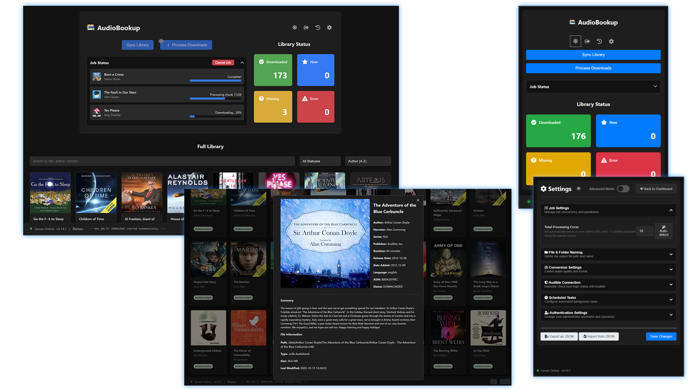

<p align="center">
  
</p>
<h1 align="center">AudioBookup</h1>
<h3 align="center">A self-hosted application with a modern web interface for managing and downloading your personal Audible audiobook library.</h3>

<br/>

<p align="center">
  
</p>

This entire system runs as a single Docker container, providing a seamless user experience from first-run authentication to basic day-to-day library management, all through a clean web interface. It features persistent background jobs for syncing and downloading, intelligent parallel processing to maximize conversion speed, and provides granular, real-time progress updates directly in the UI.

## Features

- **Modern & Responsive UI:** Manage your library through a redesigned dashboard, optimized for both desktop and mobile use.
- **Light & Dark Modes:** Switch between light and dark themes, with your preference saved in your browser for future visits.
- **Secure User Login:** The entire web interface is protected by a persistent, session-based authentication system.
- **Search, Sort, & Filter:** Instantly search your library by title, author, or narrator, filter by book status (New, Missing, etc.), and sort by multiple criteria.
- **Persistent Background Jobs:** Start a library sync or a batch download and safely close your browser. The job runs on the server and you can reconnect to it at any time.
- **Live Job Status Panel:** A collapsible "Job Status" panel shows **granular, real-time progress**.
- **Independent Sync Modes (Fast & Deep):**
    - **Fast Sync (API-only):** A lightweight sync that only checks for new books from Audible. Perfect for frequent, low-impact checks.
    - **Deep Sync (Full Scan):** A comprehensive sync that also scans all local files to detect manual changes.
- **Advanced Scheduling:** The application is powered by a robust, cron-based scheduler for maximum flexibility and reliability.
    - **Independent Schedules:** Configure separate, automated schedules for Fast Syncs, Deep Syncs, and Download jobs.
    - **Simple & Advanced Modes:** Configure schedules using a simple UI (e.g., "every 4 hours" or "daily at 02:00"). Enable **Advanced Mode** to set schedules with full, standard **cron expressions**.
    - **Timezone Support:** A dedicated setting allows you to select your local timezone, ensuring all scheduled jobs run at the correct local time. _Ensure the timezone is properly set in your docker compose file for this feature to work properly._
- **Intelligent Parallel Processing:** The application uses a sophisticated, priority-based task runner to process multiple books and chapters in parallel. It intelligently allocates all available CPU cores to the highest-priority tasks, ensuring maximum efficiency and the fastest possible completion time for each book based on the resources allocated to the container.
- **Job Management:** Cancel in-progress download jobs directly from the UI.
- **Job History with Filtering & Search:** View a complete history of all past jobs on a dedicated `/history` page. The page includes controls to **filter** by job type and status, and to **search** for jobs containing specific books by title or author.
- **Detailed Book View:** Click on any book to see a detailed modal with high-resolution art and full metadata. By default, summaries of each item are truncated, but a full summary of the book can be grabbed with a single button.
- **Settings Configuration:** Configure features from a dedicated `/settings` page. This includes custom folder/file naming templates, audio quality, and a simplified "Job Settings" UI that allows for auto-detection of CPU cores in Normal Mode, or manual control over `Total Processing Cores` and `Max Parallel Downloads` in Advanced Mode.
- **Audible Connection Health Check:** The app automatically checks if its connection to Audible is still valid on a periodic basis and displays a prominent warning banner if re-authentication is needed.
- **DRM-Free Conversion:** Converts your audiobooks into standard `.m4b` files with chapters and metadata intact.
- **Simple Docker Deployment:** Runs as a single, easy-to-manage Docker container with a clean, separated data structure.

---

## Getting Started

### Prerequisites

- Docker and Docker Compose installed on your system.
- An audible account.
- Git (only required for the developer installation).

### Installation

This guide provides three methods for installation. For most users, including those on Unraid, the **Docker Compose** method is the recommended and easiest path.

#### Docker Compose (Recommended)

This method uses the pre-built Docker image from GitHub Packages.

1.  **Create a Directory:**
    On your server, create a dedicated folder to hold your configuration file.

    ```bash
    mkdir audiobookup
    cd audiobookup
    ```

2.  **Create `docker-compose.yml`:**
    Inside that folder, create a new file named `docker-compose.yml` and paste the following content into it. An example compose file is avaialble in the project repo as `docker-compose.yml`.

    ```yaml
    services:
        audiobookup:
            # PULLS THE PRE-BUILT IMAGE:
            # For the latest stable version, use the :latest tag.
            # For maximum stability, pin to a specific version by changing ':latest'
            # to a release number, e.g., ':v0.14.1'.
            image: ghcr.io/ishbuggy/audiobookup:latest
            container_name: audiobookup
            ports:
                - "13300:13300"
            environment:
                # --- USER & PERMISSIONS ---
                # Set to your user's ID to avoid file permission issues.
                # Find this by running the 'id' command in your terminal.
                - PUID=1000
                - PGID=1000

                # --- TIMEZONE ---
                # Set your local timezone to ensure scheduled tasks run correctly.
                # A full list can be found here: https://en.wikipedia.org/wiki/List_of_tz_database_time_zones
                - TZ=Etc/UTC
            volumes:
                # --- DATA PATHS ---
                # It is highly recommended to change these to absolute paths.
                # This prevents data loss if you move your compose file.
                # Example: /path/to/my/appdata/audiobookup/config:/config

                # Volume for app configuration, settings, logs, and caches
                - ./appdata/config:/config

                # Volume for the critical database and Audible auth files
                - ./appdata/database:/database

                # Volume where your final, converted .m4b audiobook files will be stored
                - ./audiobooks:/data
            restart: unless-stopped
    ```

3.  **Configure and Launch:**
    - Edit the file you just created to set your `PUID`, `PGID`, `TZ`, and `volumes` to match your system.
    - From your project directory, run: `docker compose up -d`

4.  **Access the Web UI:**
    Navigate to `http://<your-server-ip>:13300`.

---

#### Unraid Installation

This application is ideal for Unraid using the **Docker Compose Manager** plugin.

1.  **Install Plugin:**
    On Unraid, go to the **"Apps"** tab and install the **"Docker Compose Manager"** plugin.

2.  **Add New Stack:**
    - Go to the **"Docker"** tab, open **"Compose Manager"**, and click **"Add New Stack"**.
    - Give the stack a name (e.g., `audiobookup`).
    - In the **"Composition"** box, paste the `docker-compose.yml` content from the section above.

3.  **Edit for Unraid:**
    You **must** edit the pasted content to match your Unraid shares and permissions.
    - Change `PUID` to `99` and `PGID` to `100`.
    - Change `TZ` to your correct timezone (e.g., `America/New_York`).
    - **Crucially, change the `volumes` to use absolute paths to your Unraid shares.** Example:

    ```diff
    -    volumes:
    -      - ./appdata/config:/config
    -      - ./appdata/database:/database
    -      - ./audiobooks:/data
    +    volumes:
    +      - /mnt/user/appdata/audiobookup/config:/config
    +      - /mnt/user/appdata/audiobookup/database:/database
    +      - /mnt/user/Audiobooks:/data
    ```

4.  **Launch:**
    Click **"Save"**, then click the gear icon next to the new stack and select **"Compose Up"**.

5.  **Access the Web UI:**
    Navigate to `http://<your-server-ip>:13300`.

---

#### Manual Build / For Developers

Follow these steps only if you intend to modify the source code.

1.  **Clone the Repository:**

    ```bash
    git clone https://github.com/ishbuggy/audiobookup.git
    cd audiobookup
    ```

2.  **Create a Development Compose File:**
    The repository includes a template file. Copy it to create your local, git-ignored development configuration.

    ```bash
    cp docker-compose.dev.yml.template docker-compose.dev.yml
    ```

    Now, edit `docker-compose.dev.yml` to set your `PUID`, `PGID`, and desired volume paths.

3.  **Build and Launch:**
    Use the `-f` flag to specify your development file and `--build` to build the image from your local source code.

    ```bash
    docker compose -f docker-compose.dev.yml up --build -d
    ```

4.  **Access the Web UI:**
    Navigate to `http://<your-server-ip>:13300`.

---

## First-Time Setup

On the very first launch, the application requires a multi-step setup process to secure the application and connect it to your Audible account.

### Step 1: Initial Login & Password Change

1.  **Access the Login Page:** Navigate to `http://<your-server-ip>:13300`. You will be immediately redirected to a secure login page.
2.  **Use Default Credentials:** Log in with the default username `admin` and password `changeme`.
3.  **Set a Secure Password:** Upon your first successful login, you will be automatically redirected to a mandatory "Initial Setup" page. You must set a new, secure password for the administrator account before you can proceed.

### Step 2: Connect to Audible

After setting your password, you will be guided through a graphical user interface to connect to your Audible account.

1.  **Configure Connection:** Select your Audible marketplace region from the dropdown menu.
2.  **Start Connection:** Click the "Start Connection" button.
3.  **Open Login Page:** The application will communicate with Audible's servers. A new button, "Open Audible Login Page", will appear. Click this button to open the official Audible login page in a new browser tab.
4.  **Log In to Audible:** Log in to your Audible account in the new tab.
5.  **Copy the Redirect URL:** After logging in, your browser will be redirected to a page that likely shows an error (e.g., "Page not found"). **This is expected.** Copy the _entire URL_ from your browser's address bar.
6.  **Submit the URL and Validate:** Return to the application tab, paste the long URL into the input box, and click "Submit URL". The application will validate your login.
7.  **Performance Optimization:** Set the number of workers that will be spun up to process books. Use the auto detect feature that can detemrine how many CPU cores are avaiable to the container, or manually enter a number. After this is complete, you will be automatically redirected to the main dashboard.

---

## How to Use (Normal Mode)

Once setup is complete, the application will always start in **Normal Mode**, taking you directly to the main dashboard.

### Dashboard Overview

The dashboard is organized into a responsive two-column layout for a clear information hierarchy.

- **Header:** The header contains the application logo and title, along with quick-access icons for **Theme Toggling**, **Settings**, **Job History**, and **Logging Out**.
- **Main Action Column (Left):** This is the primary interaction area.
    - **Core Actions:** The main "Sync Library" and "Process Downloads" buttons are at the top.
    - **Automation Banner:** A banner appears here if automated tasks are disabled, linking directly to the relevant settings.
    - **Job Status:** When a job is active, a collapsible panel appears in this column, showing real-time progress. This panel persists even if you reload the page. You can **Cancel** running download jobs from here.
- **Status Column (Right):** This area provides an at-a-glance overview of your library.
    - **Library Status:** Colorful cards show the total number of books that are Downloaded, New, Missing, or have Errors.
- **Full Library:** Below the main columns, a responsive grid displays your entire audiobook library, which can be instantly **searched**, **sorted**, and **filtered by status**.
- **Status Bar & Activity Log:** A sticky footer shows the most recent status update and can be expanded to view the full application log for some debugging without needing to dig into docker logs.

### Core Actions

- **Sync Library:** The main button on the dashboard always performs a comprehensive **Deep Sync**. It connects to the Audible API, downloads cover art, and reconciles the database with a full scan of all local files. This runs as a **persistent background job**, so you can safely close the browser. More frequent, API-only **Fast Syncs** can be configured as a separate, automated task on the Settings page.
- **Process Downloads:** Opens a selection modal to start a batch download, which runs as a persistent background job.
- **Retry Button:** For any book with a status of `ERROR` or `MISSING`, a "Retry" button will appear on its card to process only that book using the persistent job system.

---

## Maintenance and Troubleshooting

## Updating the Application

The update process depends on your original installation method.

---

#### Docker Compose (Recommended)

This is the standard update method for users who deployed using a `docker-compose.yml` file.

1.  **Navigate to your project directory:**
    Open a terminal and `cd` into the folder where your `docker-compose.yml` file is located.

    ```bash
    cd /path/to/your/audiobookup
    ```

2.  **Handle the Image Tag:**
    - **If you are using the `:latest` tag** in your `docker-compose.yml`, you don't need to edit the file.
    - **If you pinned a specific version** (e.g., `ghcr.io/ishbuggy/audiobookup:v0.14.1`), you must open your `docker-compose.yml` file and update the tag to the new version (e.g., `:v0.14.2`).

3.  **Pull the new image and restart the container:**
    Run the following two commands. The `pull` command downloads the new image, and the `up -d` command restarts the container with the new image.

    ```bash
    docker compose pull
    docker compose up -d
    ```

---

#### Unraid

Updating on Unraid uses the **Docker Compose Manager** plugin's built-in functionality.

1.  On your Unraid dashboard, go to the **"Docker"** tab.
2.  Click on **"Compose Manager"**.
3.  Find your `audiobookup` stack in the list.
4.  **If you pinned a specific version** in your composition, click the **"Edit"** button, change the image tag to the new version (e.g., `:v0.14.2`), and click **"Save"**. If you are using `:latest`, you can skip this step.
5.  Click the gear icon next to the `audiobookup` stack and select **"Update"**. This will pull the new image and automatically recreate the container.

---

#### Manual Build / For Developers

This method is for users who are building the image from the source code.

1.  **Navigate to the repository directory:**
    Open a terminal and `cd` into the cloned `audiobookup` repository.

2.  **Pull the latest code from GitHub:**
    This command will download all the latest source code changes.

    ```bash
    git pull
    ```

3.  **Rebuild and restart the container:**
    Run the `docker compose` command with the `--build` flag. This forces Docker to rebuild the image using the new code you just pulled.

    ```bash
    docker compose -f docker-compose.dev.yml up -d --build
    ```

### Managing Settings

Application settings are stored on your host machine at `./appdata/config/settings.json`. You can back up this file to save your configuration.

### Clearing the Image Cache

Cover art is cached on your host machine at `./appdata/config/covers`. To refresh them:

1.  Stop the container: `docker-compose down`
2.  Delete the covers directory: `rm -rf ./appdata/config/covers`
3.  Restart and run a **Sync Library**.

### Resetting Your Audible Connection

If your connection to Audible expires (e.g., you change your Audible password), use the **"Re-authenticate"** button that appears in the UI banner. For a full manual reset of the Audible connection:

1.  Stop the container: `docker-compose down`
2.  Delete the Audible setup flag and the authentication directory from your **database** volume:
    ```bash
    rm ./appdata/database/.setup_complete
    rm -rf ./appdata/database/.audible
    ```
3.  Restart the container: `docker-compose up -d`. You will be guided through the **Audible Setup** part of the first-time setup process again.

### Resetting Your Local User Password

If you forget the password you set for the web UI, you can reset it manually:

1.  Stop the container: `docker-compose down`
2.  Open the settings file on your host machine: `./appdata/config/settings.json`.
3.  Find the `"initial_setup_complete"` key and set its value to `false`.
4.  Save and close the file.
5.  Restart the container: `docker-compose up -d`.
6.  You can now log in with the default credentials (`admin` / `changeme`) and will be forced to set a new password.

### Accessing the Database Manually

You can directly interact with the SQLite database for advanced debugging.

```bash
# Get a shell inside the running container
docker-compose exec audible-downloader /bin/bash

# Access the database file from its new location
sqlite3 /database/library.db

# Example: List all books with an ERROR status
sqlite> SELECT author, title FROM audiobooks WHERE status = 'ERROR';

# Exit sqlite and the container
sqlite> .exit
exit
```
