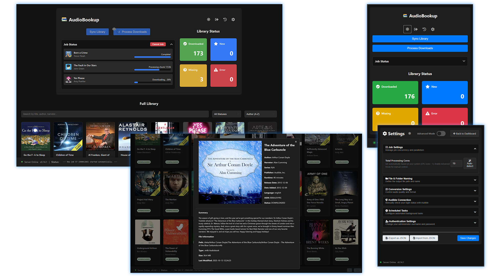

<p align="center">
  
</p>
<h1 align="center">AudioBookup</h1>
<h3 align="center">A self-hosted application with a modern web interface for managing and downloading your personal Audible audiobook library.</h3>

<br/>

<p align="center">
  
</p>

This entire system runs as a single Docker container, providing a seamless user experience from first-run authentication to basic day-to-day library management, all through a clean web interface. It features persistent background jobs for syncing and downloading, intelligent parallel processing to maximize conversion speed, and provides granular, real-time progress updates directly in the UI.

## Features

- **Modern & Responsive UI:** Manage your library through a redesigned dashboard, optimized for both desktop and mobile use.
- **Light & Dark Modes:** Switch between light and dark themes, with your preference saved in your browser for future visits.
- **Secure User Login:** The entire web interface is protected by a persistent, session-based authentication system.
- **Search, Sort, & Filter:** Instantly search your library by title, author, or narrator, filter by book status (New, Missing, etc.), and sort by multiple criteria.
- **Persistent Background Jobs:** Start a library sync or a batch download and safely close your browser. The job runs on the server and you can reconnect to it at any time.
- **Live Job Status Panel:** A collapsible "Job Status" panel shows **granular, real-time progress**.
- **Independent Sync Modes (Fast & Deep):**
    - **Fast Sync (API-only):** A lightweight sync that only checks for new books from Audible. Perfect for frequent, low-impact checks.
    - **Deep Sync (Full Scan):** A comprehensive sync that also scans all local files to detect manual changes.
- **Advanced Scheduling:** The application is powered by a robust, cron-based scheduler for maximum flexibility and reliability.
    - **Independent Schedules:** Configure separate, automated schedules for Fast Syncs, Deep Syncs, and Download jobs.
    - **Simple & Advanced Modes:** Configure schedules using a simple UI (e.g., "every 4 hours" or "daily at 02:00"). Enable **Advanced Mode** to set schedules with full, standard **cron expressions**.
    - **Timezone Support:** A dedicated setting allows you to select your local timezone, ensuring all scheduled jobs run at the correct local time. _Ensure the timezone is properly set in your docker compose file for this feature to work properly._
- **Intelligent Parallel Processing:** The application uses a sophisticated, priority-based task runner to process multiple books and chapters in parallel. It intelligently allocates all available CPU cores to the highest-priority tasks, ensuring maximum efficiency and the fastest possible completion time for each book based on the resources allocated to the container.
    - **Smart Auto-Chunking:** Automatically detects books consisting of a single massive chapter (longer than 30 minutes) and splits them into 15-minute segments for easier playback navigation.
- **Rich Metadata Tagging:** Files are now tagged with extended metadata (Genre, Album, Album Artist, Publisher, Audible ASIN) for perfect integration with players like Plex, Audiobookshelf, and Apple Books.
- **Smart File Management:**
    - **Collision Protection:** Automatically detects and renames files to prevent overwriting different editions of the same book (e.g., different narrators).
    - **Expanded Naming Templates:** Organize your library your way using placeholders like `{author}`, `{title}`, `{narrator}`, `{publisher}`, `{asin}`, `{series}`, `{series_part}`, `{year}`, and `{language}`. A book missing a value (e.g. a standalone title has no series) simply drops that part of the path cleanly — no empty or "N/A" folders.
    - **Separate Folder & File Templates:** If you'd rather describe the folder structure and the file name independently, Advanced Mode offers a Folder Template and a File Template alongside the single template. Fill in **both** and they're used together as "folder/file", replacing the single template; leave either one blank and the single template is used as usual.
    - **File Timestamp Source:** Optionally stamp each finished audiobook (and its companion files) with the book's release date or the date you purchased it, instead of the time it was downloaded, so file browsers and media servers can sort by it.
- **Context-Aware Downloads:** Library cards offer a one-click "Download" for books not yet on disk, while already-downloaded books can be "Force Re-download"-ed from their detail modal to fix corruption or update tags.
- **Maintenance Tools:** Built-in tools to **Clear Image Cache** and **Reset Audible Connection** directly from the Settings UI, removing the need for manual file system operations.
- **Job History with Filtering & Search:** View a complete history of all past jobs on a dedicated `/history` page. The page includes controls to **filter** by job type and status, and to **search** for jobs containing specific books by title or author.
- **Detailed Book View:** Click on any book to see a detailed modal with high-resolution art and full metadata. By default, summaries of each item are truncated, but a full summary of the book can be grabbed with a single button.
- **Settings Configuration:** Configure features from a dedicated `/settings` page, split into a **Standard** view for everyday options (output format, quality, naming, cover art, and more) and a single **Advanced Mode** toggle that reveals the full power-user surface — download-quality requests, MP3/LAME tuning, chapter and metadata cleanups, sidecar files, separate folder/file naming templates, the file-timestamp source, and manual control over `Total Processing Cores` / `Max Parallel Downloads` (vs. Standard mode's CPU auto-detection) — without cluttering the page for everyday use.
- **Audible Connection Health Check:** The app automatically checks if its connection to Audible is still valid on a periodic basis and displays a prominent warning banner if re-authentication is needed.
- **DRM-Free Conversion:** Converts your audiobooks into standard, DRM-free files with chapters and metadata intact — a re-encoded AAC `.m4b`, a lossless "Original" remux, or an `.mp3`.
- **Simple Docker Deployment:** Runs as a single, easy-to-manage Docker container with a clean, separated data structure.

## Audio Conversion & Quality

AudioBookup gives you a choice of **output format** for every book, plus a separate control over the **quality requested from Audible** at download time. These are two different axes — what you ask Audible to serve, and what AudioBookup does with it afterward — and the Settings page keeps them clearly labeled as such.

### Output Format

Choose from three output formats on the Settings page:

*   **AAC `.m4b` (default):** AudioBookup **re-encodes** your books into a standardized, high-quality AAC format. Although stripping DRM and simply copying the raw data stream is fast and effective, re-encoding buys precision and compatibility, even if it takes more processing time to do it:
    *   **Precision:** Re-encoding allows for frame-perfect chapter splitting. This ensures chapters start *exactly* at the correct millisecond, preventing cut-off words or awkward glitches which can happen in direct-stream copies.
    *   **Universal Compatibility:** The resulting `.m4b` files are clean, standardized containers guaranteed to work on any player—from modern media servers (Storyteller, Audiobookshelf, Plex) to legacy hardware and mobile apps.
    *   **Storage Control:** You can choose your preferred quality (High, Standard, Low) to balance audio fidelity with file size.
*   **Original (lossless remux):** Skips re-encoding entirely — the decrypted audio stream is repackaged into an `.m4b` container as-is, with no quality loss and the least processing time. The trade-off is that chapters land wherever Audible's own markers fall (no frame-perfect splitting), and the branding trim described below doesn't apply to it — the other chapter/metadata cleanups do.
*   **MP3:** Encodes a single `.mp3` file per book in one pass over the whole audiobook, rather than per-chapter — this avoids the small gaps and chapter drift that come from stitching together separately-encoded chunks. Chapters and cover art are embedded directly in the file, alongside the audio, in the same encoding pass. Quality is configurable: target a VBR quality level or a specific bitrate (CBR or ABR, optionally matched to the source), with optional mono downmixing and a sample-rate cap. MP3 encoding is single-threaded and takes longer per book than AAC, in exchange for a format that's readable by effectively any player.

### Download Quality

Separate from the output format above, you can also choose the **quality requested from Audible** itself when downloading — Best, High, or Normal. This controls what Audible serves *before* any local conversion happens; it's an advanced setting (default Best), useful mainly if you want smaller downloads.

### Sidecar Files

Optionally, AudioBookup can save extra files alongside your converted audiobook, sharing its filename:

*   A cover image (`.jpg`/`.png`)
*   A curated `metadata.json` (author, narrator, series, genres, description, and more)
*   A `.cue` sheet mapping chapters to timestamps
*   The original, undecrypted AAX/AAXC file (plus its `.voucher`), if you'd like to keep the raw source

All four are off by default, and each is saved best-effort — a failure writing one never blocks the download itself.

### Chapter & Metadata Cleanups

A set of optional cleanups, all off by default so nothing changes unless you turn it on:

*   **Combine nested chapter titles:** Flattens a multi-part book's nested chapter tree into a single navigable list, joining parent and child titles (e.g. "Part 1: Chapter 1").
*   **Merge Opening/End Credits:** Folds Audible's "Opening Credits" and "End Credits" markers into the neighboring chapter instead of leaving them as their own short chapter.
*   **Strip "(Unabridged)":** Removes the "(Unabridged)" suffix Audible appends to many titles from the embedded title/album tags. A custom title you've set yourself is left untouched.
*   **Chapter title template:** Customize how chapter titles are written into the file using `{ch}`, `{ch_total}`, `{ch_title}`, and `{title}` placeholders.
*   **Trim Audible's branded intro/outro:** Cuts Audible's "This is Audible" branding clip from the start and end of the audio. This only applies to AAC and MP3 re-encodes — **Original (lossless remux) output is never trimmed**, since there's no encoding pass to cut a span out of.

> **Not supported:** Widevine DRM, xHE-AAC, and Spatial Audio — these require Libation's Widevine license path; audible-cli cannot request them.

---

## Getting Started

### Prerequisites

- Docker and Docker Compose installed on your system.
- An audible account.
- Git (only required for the developer installation).

### Installation

This guide provides three methods for installation. For most users, including those on Unraid, the **Docker Compose** method is the recommended and easiest path.

#### Docker Compose (Recommended)

This method uses the pre-built Docker image from GitHub Packages.

1.  **Create a Directory:**
    On your server, create a dedicated folder to hold your configuration file.

    ```bash
    mkdir audiobookup
    cd audiobookup
    ```

2.  **Create `docker-compose.yml`:**
    Inside that folder, create a new file named `docker-compose.yml` and paste the following content into it. An example compose file is avaialble in the project repo as `docker-compose.yml`.

    ```yaml
    services:
        audiobookup:
            # PULLS THE PRE-BUILT IMAGE:
            # For the latest stable version, use the :latest tag.
            # For maximum stability, pin to a specific version by changing ':latest'
            # to a release number, e.g., ':v0.14.1'.
            image: ghcr.io/ishbuggy/audiobookup:latest
            container_name: audiobookup
            ports:
                - "13300:13300"
            environment:
                # --- USER & PERMISSIONS ---
                # Set to your user's ID to avoid file permission issues.
                # Find this by running the 'id' command in your terminal.
                - PUID=1000
                - PGID=1000

                # OPTIONAL: Set to 'true' to skip permission checks on /data on startup.
                # Recommended for macOS users or libraries with 1000+ books to speed up boot time.
                # - SKIP_DATA_PERMS=true

                # OPTIONAL: File-permission mask for files the app creates. The default (0002)
                # produces group-writable files (664) and directories (775). Set to 0000 for
                # world-writable output (666/777), e.g. for some NAS/SMB share setups.
                # - UMASK=0002

                # --- TIMEZONE ---
                # Set your local timezone to ensure scheduled tasks run correctly.
                # A full list can be found here: https://en.wikipedia.org/wiki/List_of_tz_database_time_zones
                - TZ=Etc/UTC
            volumes:
                # --- DATA PATHS ---
                # It is highly recommended to change these to absolute paths.
                # This prevents data loss if you move your compose file.
                # Example: /path/to/my/appdata/audiobookup/config:/config

                # Volume for app configuration, settings, logs, and caches
                - ./appdata/config:/config

                # Volume for the critical database and Audible auth files
                - ./appdata/database:/database

                # Volume where your final, converted .m4b audiobook files will be stored
                - ./audiobooks:/data
            restart: unless-stopped
    ```

3.  **Configure and Launch:**
    - Edit the file you just created to set your `PUID`, `PGID`, `TZ`, and `volumes` to match your system.
    - From your project directory, run: `docker compose up -d`

4.  **Access the Web UI:**
    Navigate to `http://<your-server-ip>:13300`.

---

#### Unraid Installation

This application is ideal for Unraid using the **Docker Compose Manager** plugin.

1.  **Install Plugin:**
    On Unraid, go to the **"Apps"** tab and install the **"Docker Compose Manager"** plugin.

2.  **Add New Stack:**
    - Go to the **"Docker"** tab, open **"Compose Manager"**, and click **"Add New Stack"**.
    - Give the stack a name (e.g., `audiobookup`).
    - In the **"Composition"** box, paste the `docker-compose.yml` content from the section above.

3.  **Edit for Unraid:**
    You **must** edit the pasted content to match your Unraid shares and permissions.
    - Change `PUID` to `99` and `PGID` to `100`.
    - Change `TZ` to your correct timezone (e.g., `America/New_York`).
    - **Crucially, change the `volumes` to use absolute paths to your Unraid shares.** Example:

    ```diff
    -    volumes:
    -      - ./appdata/config:/config
    -      - ./appdata/database:/database
    -      - ./audiobooks:/data
    +    volumes:
    +      - /mnt/user/appdata/audiobookup/config:/config
    +      - /mnt/user/appdata/audiobookup/database:/database
    +      - /mnt/user/Audiobooks:/data
    ```

4.  **Launch:**
    Click **"Save"**, then click the gear icon next to the new stack and select **"Compose Up"**.

5.  **Access the Web UI:**
    Navigate to `http://<your-server-ip>:13300`.

---

#### Manual Build / For Developers

Follow these steps only if you intend to modify the source code.

1.  **Clone the Repository:**

    ```bash
    git clone https://github.com/ishbuggy/audiobookup.git
    cd audiobookup
    ```

2.  **Create a Development Compose File:**
    The repository includes a template file. Copy it to create your local, git-ignored development configuration.

    ```bash
    cp docker-compose.dev.yml.template docker-compose.dev.yml
    ```

    Now, edit `docker-compose.dev.yml` to set your `PUID`, `PGID`, and desired volume paths.

3.  **Build and Launch:**
    Use the `-f` flag to specify your development file and `--build` to build the image from your local source code.

    ```bash
    docker compose -f docker-compose.dev.yml up --build -d
    ```

4.  **Access the Web UI:**
    Navigate to `http://<your-server-ip>:13300`.

---

## First-Time Setup

On the very first launch, the application requires a multi-step setup process to secure the application and connect it to your Audible account.

### Step 1: Initial Login & Password Change

1.  **Access the Login Page:** Navigate to `http://<your-server-ip>:13300`. You will be immediately redirected to a secure login page.
2.  **Use Default Credentials:** Log in with the default username `admin` and password `changeme`.
3.  **Set a Secure Password:** Upon your first successful login, you will be automatically redirected to a mandatory "Initial Setup" page. You must set a new, secure password for the administrator account before you can proceed.

### Step 2: Connect to Audible

After setting your password, you will be guided through a graphical user interface to connect to your Audible account.

1.  **Configure Connection:** Select your Audible marketplace region from the dropdown menu.
2.  **Start Connection:** Click the "Start Connection" button.
3.  **Open Login Page:** The application will communicate with Audible's servers. A new button, "Open Audible Login Page", will appear. Click this button to open the official Audible login page in a new browser tab.
4.  **Log In to Audible:** Log in to your Audible account in the new tab.
5.  **Copy the Redirect URL:** After logging in, your browser will be redirected to a page that likely shows an error (e.g., "Looking for something?" or "Page not found"). **This is expected.** The page will look something like the image below. Copy the _entire URL_ from your browser's address bar.

    <p align="center">
      
    </p>

6.  **Submit the URL and Validate:** Return to the application tab, paste the long URL into the input box, and click "Submit URL". The application will validate your login.
7.  **Performance Optimization:** Set the number of workers that will be spun up to process books. Use the auto detect feature that can detemrine how many CPU cores are avaiable to the container, or manually enter a number. After this is complete, you will be automatically redirected to the main dashboard.

---

## How to Use (Normal Mode)

Once setup is complete, the application will always start in **Normal Mode**, taking you directly to the main dashboard.

### Dashboard Overview

- **Job Status Panel:** When a Sync or Download is active, a real-time progress panel appears. You can safely close the browser while jobs run in the background, or click **Cancel Job** to stop them immediately.
- **Automation Banner:** If your scheduled tasks are disabled, a banner will appear to remind you. Clicking it takes you directly to the scheduler settings.
- **Library Grid:** The main view supports instant client-side searching, sorting, and filtering (e.g., viewing only "Error" items).
- **Activity Log:** The sticky footer shows the latest status. Expand it to view the live log, copy it to your clipboard, or download the full `app.log` file for debugging.

### Core Actions

- **Sync Library:** Triggers a manual **Deep Sync** (API fetch + full disk scan). This ensures your database matches your files perfectly.
- **Process Downloads:** Opens a selection modal to batch download books marked as `NEW`, `MISSING`, or `ERROR`.
- **Force Re-download:** Opened via the Book Detail modal, this allows you to re-download a specific book (overwriting the existing file) to fix glitches or update metadata.
- **Download:** Appears on individual book cards for books not yet on disk (New, Missing, or Error). Clicking it instantly queues that specific book.

---

## Deployment Notes

AudioBookup is designed as a **single-user, self-hosted** application. It runs on Flask's built-in threaded server (plus a threading-mode Socket.IO server for the setup wizard), which is a deliberate choice for its purpose: one user, a handful of browser tabs, on a private network. Two practical consequences:

- Each open dashboard tab holds a long-lived server thread for its real-time updates (Server-Sent Events). A few tabs are fine; exposing the app to many concurrent users is not what it's built for.
- If you put a reverse proxy in front of the app, it must forward the `Host` header (the standard configuration in nginx, Caddy, Traefik, etc.). The built-in CSRF protection compares each write request's `Origin` against that host and rejects mismatches.

---

## Maintenance and Troubleshooting

## Updating the Application

The update process depends on your original installation method.

---

#### Docker Compose (Recommended)

This is the standard update method for users who deployed using a `docker-compose.yml` file.

1.  **Navigate to your project directory:**
    Open a terminal and `cd` into the folder where your `docker-compose.yml` file is located.

    ```bash
    cd /path/to/your/audiobookup
    ```

2.  **Handle the Image Tag:**
    - **If you are using the `:latest` tag** in your `docker-compose.yml`, you don't need to edit the file.
    - **If you pinned a specific version** (e.g., `ghcr.io/ishbuggy/audiobookup:v0.14.1`), you must open your `docker-compose.yml` file and update the tag to the new version (e.g., `:v0.14.2`).

3.  **Pull the new image and restart the container:**
    Run the following two commands. The `pull` command downloads the new image, and the `up -d` command restarts the container with the new image.

    ```bash
    docker compose pull
    docker compose up -d
    ```

---

#### Unraid

Updating on Unraid uses the **Docker Compose Manager** plugin's built-in functionality.

1.  On your Unraid dashboard, go to the **"Docker"** tab.
2.  Click on **"Compose Manager"**.
3.  Find your `audiobookup` stack in the list.
4.  **If you pinned a specific version** in your composition, click the **"Edit"** button, change the image tag to the new version (e.g., `:v0.14.2`), and click **"Save"**. If you are using `:latest`, you can skip this step.
5.  Click the gear icon next to the `audiobookup` stack and select **"Update"**. This will pull the new image and automatically recreate the container.

---

#### Manual Build / For Developers

This method is for users who are building the image from the source code.

1.  **Navigate to the repository directory:**
    Open a terminal and `cd` into the cloned `audiobookup` repository.

2.  **Pull the latest code from GitHub:**
    This command will download all the latest source code changes.

    ```bash
    git pull
    ```

3.  **Rebuild and restart the container:**
    Run the `docker compose` command with the `--build` flag. This forces Docker to rebuild the image using the new code you just pulled.

    ```bash
    docker compose -f docker-compose.dev.yml up -d --build
    ```

### Managing Settings

Application settings are stored on your host machine at `./appdata/config/settings.json`. You can back up this file to save your configuration, and can import a saved configuration file.

### Clearing the Image Cache

Cover art is cached on your host machine at `./appdata/config/covers`. If images appear broken or you want to force a refresh:

1.  Navigate to the **Settings** page.
2.  Scroll to the **Audible Connection** section.
3.  Click the **"Clear Cache"** button.
4.  Confirm the action. All images will be deleted and re-downloaded during the next **Sync Library**.

### Resetting Your Audible Connection

If your connection to Audible expires (e.g., you change your Audible password) or you wish to switch accounts:

1.  Navigate to the **Settings** page.
2.  Scroll to the **Audible Connection** section.
3.  Click the **"Reset Connection"** button.
4.  Confirm the action. The application will securely delete your authentication tokens and restart itself.
5.  You will be automatically redirected to the **First-Time Setup** wizard to reconnect.

_(Manual Method: If you cannot access the UI, you can still reset by stopping the container and deleting `.setup_complete` and the `.audible` directory from your `/database` volume.)_

### Verifying Library Integrity

If you suspect files are corrupt or incomplete (e.g., a 13-hour book is only 2 hours long), you can audit your library:

1.  Navigate to the **Settings** page.
2.  Scroll to the **Audible Connection** section.
3.  Click the **"Verify Files"** button.
4.  The application will scan every downloaded book. If a discrepancy is found, the book's status will change to **ERROR**.
5.  Go to the Dashboard, filter by **Error**, and click **Download** to re-download the correct file.

### Resetting Your Local User Password

If you forget the password you set for the web UI, you can reset it manually:

1.  Stop the container: `docker-compose down`
2.  Open the settings file on your host machine: `./appdata/config/settings.json`.
3.  Find the `"initial_setup_complete"` key and set its value to `false`.
4.  Save and close the file.
5.  Restart the container: `docker-compose up -d`.
6.  You can now log in with the default credentials (`admin` / `changeme`) and will be forced to set a new password.

### Getting Detailed Logs

To help with debugging or reporting issues, the application logs can be accessed directly from the footer of the dashboard.
*   **Copy Log:** Copies the currently visible log lines to your clipboard.
*   **Download Log:** Downloads the full `app.log` file (which contains detailed `DEBUG` information not shown in the UI) to your computer.

### Accessing the Database Manually

You can directly interact with the SQLite database for advanced debugging.

```bash
# Get a shell inside the running container
docker-compose exec audible-downloader /bin/bash

# Access the database file from its new location
sqlite3 /database/library.db

# Example: List all books with an ERROR status
sqlite> SELECT author, title FROM audiobooks WHERE status = 'ERROR';

# Exit sqlite and the container
sqlite> .exit
exit
```

### Optimizing Startup Speed (macOS / Large Libraries)

On startup, the container ensures you have write permissions to your `/data` folder. On macOS (due to Docker file sharing) or with extremely large libraries (1000+ books), this scan can take several minutes, making the app look like it has hung.

To skip this check, add the following environment variable to your `docker-compose.yml`:

```yaml
environment:
  - SKIP_DATA_PERMS=true
```

*Note: If you use this, ensure your host folder permissions are correct manually, or the app may fail to write files.*